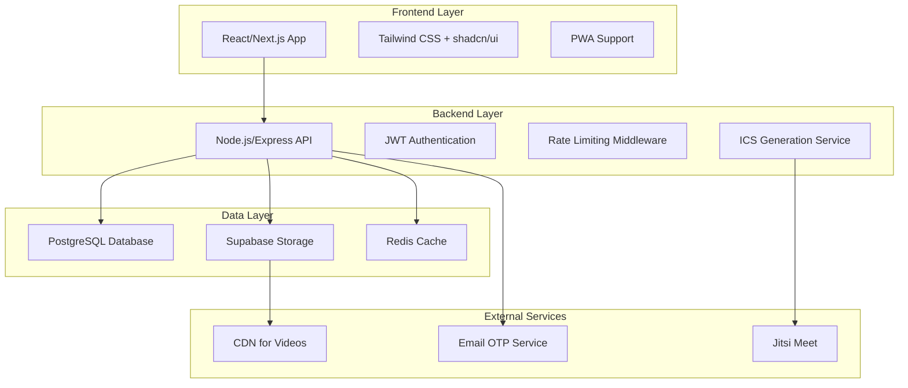

# Design Document

## Overview

SwipeHire Campus is a mutual-match micro-interview scheduler built as a web application using React/Next.js frontend with a Node.js/Express backend and PostgreSQL database. The system implements a two-stage discovery process: text-first matching followed by optional video unlock after mutual interest, culminating in instant interview scheduling with calendar integration.

The architecture prioritizes performance, bias reduction, and user experience through intelligent ranking algorithms, atomic booking operations, and seamless calendar integration.

## Architecture

### High-Level Architecture



### Technology Stack

**Frontend:**
- React 18 with Next.js 14 (App Router)
- Tailwind CSS for styling
- shadcn/ui for component library
- React Hook Form for form management
- Zustand for state management
- React Query for server state

**Backend:**
- Node.js with Express.js
- Prisma ORM for database operations
- JWT for authentication
- ics library for calendar file generation
- multer for file uploads
- rate-limiter-flexible for rate limiting

**Database & Storage:**
- PostgreSQL (via Supabase)
- Supabase Storage for video files
- Redis for caching and rate limiting

**External Services:**
- Jitsi Meet for video conferencing
- Email service for OTP delivery

## Components and Interfaces

### Frontend Components

#### Core Components
- **AuthFlow**: Handles email OTP verification and role selection
- **ProfileSetup**: Student and recruiter profile creation forms
- **FeedView**: Displays ranked cards with swipe/like functionality
- **MatchView**: Shows mutual matches with video unlock and slot booking
- **SlotManager**: Recruiter interface for creating interview slots
- **VideoModal**: Secure video player for matched users only

#### Shared Components
- **SkillChips**: Reusable skill tag display
- **CardComponent**: Base card layout for jobs/students
- **LikeButton**: Animated like/dislike interaction
- **CalendarButton**: ICS download and meeting link display
- **ReportModal**: Content reporting interface

### Backend API Interfaces

#### Authentication Endpoints
```typescript
POST /auth/otp/request
Body: { email: string }
Response: { success: boolean, message: string }

POST /auth/otp/verify
Body: { email: string, code: string }
Response: { token: string, user: User, profileComplete: boolean }
```

#### Profile Management
```typescript
GET /me
Response: { user: User, profile: StudentProfile | RecruiterProfile }

POST /students
Body: { name, branch, year, headline, skills[], projectUrl?, resumeUrl?, videoUrl? }
Response: { profile: StudentProfile }

POST /recruiters
Body: { name, org, title }
Response: { profile: RecruiterProfile }

POST /jobs
Body: { title, description, skills[], batch, location, ctcMin, ctcMax, videoUrl? }
Response: { job: Job }
```

#### Discovery & Matching
```typescript
GET /jobs/feed?page=1&limit=20
Response: { jobs: JobCard[], hasMore: boolean, remainingLikes: number }

GET /students/feed?page=1&limit=20
Response: { students: StudentCard[], hasMore: boolean, remainingLikes: number }

POST /like
Body: { toType: 'job' | 'student', toId: string }
Response: { matched: boolean, matchId?: string }

GET /matches
Response: { matches: Match[] }

GET /matches/:id
Response: { match: MatchDetail, slots: Slot[], videos: Video[] }
```

#### Scheduling
```typescript
POST /slots
Body: { jobId: string, startTs: Date, endTs: Date }
Response: { slot: Slot }

POST /book
Body: { matchId: string, slotId: string }
Response: { interview: Interview, icsUrl: string, meetUrl: string }
```

## Data Models

### Core Entities

#### User System
```typescript
interface User {
  id: string;
  email: string;
  role: 'student' | 'recruiter' | 'admin';
  createdAt: Date;
  verifiedAt?: Date;
}

interface StudentProfile {
  userId: string;
  name: string;
  branch: string;
  year: number;
  headline: string;
  skills: string[];
  projectUrl?: string;
  resumeUrl?: string;
  videoUrl?: string;
}

interface RecruiterProfile {
  userId: string;
  name: string;
  org: string;
  title: string;
}
```

#### Job & Matching System
```typescript
interface Job {
  id: string;
  recruiterId: string;
  title: string;
  description: string;
  skills: string[];
  batch: number;
  location: string;
  ctcMin: number;
  ctcMax: number;
  videoUrl?: string;
  createdAt: Date;
}

interface Like {
  id: string;
  fromUser: string;
  toType: 'job' | 'student';
  toId: string;
  stage: number;
  createdAt: Date;
}

interface Match {
  id: string;
  studentId: string;
  jobId: string;
  createdAt: Date;
}
```

#### Scheduling System
```typescript
interface Slot {
  id: string;
  jobId: string;
  startTs: Date;
  endTs: Date;
  isBooked: boolean;
}

interface Interview {
  id: string;
  matchId: string;
  slotId: string;
  meetUrl: string;
  icsPath: string;
  status: 'booked' | 'done' | 'no_show';
}
```

#### Analytics & Safety
```typescript
interface Exposure {
  userId: string;
  entityType: 'job' | 'student';
  entityId: string;
  shownAt: Date;
}

interface Report {
  id: string;
  reporterUserId: string;
  entityType: 'user' | 'job';
  entityId: string;
  reason: string;
  createdAt: Date;
}
```

## Ranking Algorithm Implementation

### Scoring Pipeline

The system implements a sophisticated ranking algorithm with the following components:

#### 1. Hard Filters (Pre-ranking)
```sql
-- Example filter for student viewing jobs
WHERE (job.batch IS NULL OR job.batch = student.year)
  AND job.id NOT IN (
    SELECT to_id FROM likes 
    WHERE from_user = :student_id AND to_type = 'job'
  )
  AND job.recruiter_id != :student_id
```

#### 2. Soft Scoring Algorithm
```typescript
function calculateScore(student: StudentProfile, job: Job): number {
  const skillsScore = jaccardSimilarity(student.skills, job.skills);
  const textScore = textSimilarity(
    student.headline + ' ' + student.projectUrl,
    job.title + ' ' + job.description
  );
  const eligibilityScore = student.year === job.batch ? 1 : 0;
  const freshnessScore = Math.max(0.7, Math.min(1.2, 
    Math.exp(-daysSince(job.createdAt) / 7)
  ));
  
  return 0.55 * skillsScore + 
         0.20 * textScore + 
         0.15 * eligibilityScore + 
         0.10 * freshnessScore;
}
```

#### 3. Diversity & Fairness
- Company spread: Maximum 3 cards per company per page
- New profile boost: +0.05 bonus for profiles with <20 impressions
- Exploration: 20% random selection from eligible candidates
- Cooldown: 7-day hiding period after dislikes

### Text Matching Implementation

```typescript
class TFIDFMatcher {
  private vocabulary: Map<string, number>;
  
  constructor(vocabulary: string[]) {
    this.vocabulary = new Map(vocabulary.map((word, idx) => [word, idx]));
  }
  
  vectorize(text: string): Record<string, number> {
    const tokens = text.toLowerCase().split(/\W+/);
    const vector: Record<string, number> = {};
    
    tokens.forEach(token => {
      if (this.vocabulary.has(token)) {
        vector[token] = (vector[token] || 0) + 1;
      }
    });
    
    return vector;
  }
  
  cosineSimilarity(vecA: Record<string, number>, vecB: Record<string, number>): number {
    let dotProduct = 0;
    let normA = 0;
    let normB = 0;
    
    for (const key in vecA) {
      if (vecB[key]) dotProduct += vecA[key] * vecB[key];
      normA += vecA[key] * vecA[key];
    }
    
    for (const key in vecB) {
      normB += vecB[key] * vecB[key];
    }
    
    return normA && normB ? dotProduct / Math.sqrt(normA * normB) : 0;
  }
}
```

## Error Handling

### API Error Responses
```typescript
interface APIError {
  error: string;
  message: string;
  code: number;
  details?: any;
}

// Standard error codes
const ErrorCodes = {
  UNAUTHORIZED: 401,
  FORBIDDEN: 403,
  NOT_FOUND: 404,
  RATE_LIMITED: 429,
  VALIDATION_ERROR: 422,
  INTERNAL_ERROR: 500
} as const;
```

### Error Handling Strategy

#### Frontend Error Boundaries
- Global error boundary for unhandled React errors
- API error handling with user-friendly messages
- Retry mechanisms for transient failures
- Offline state management

#### Backend Error Handling
- Centralized error middleware
- Structured logging with correlation IDs
- Graceful degradation for external service failures
- Database transaction rollbacks

#### Specific Error Scenarios
1. **Double Booking Prevention**: Atomic slot booking with database constraints
2. **Rate Limit Exceeded**: Clear messaging with reset time
3. **Video Upload Failures**: Fallback to URL input
4. **Calendar Generation Errors**: Retry mechanism with manual link fallback

## Security Considerations

### Authentication & Authorization
- JWT tokens with 24-hour expiration
- Role-based access control (RBAC)
- Email OTP verification for account creation
- Secure password-less authentication

### Data Protection
- Video URLs with time-limited signed access
- Row-level security (RLS) in database
- Input validation and sanitization
- CORS configuration for frontend domain

### Privacy Controls
- Videos hidden until mutual match
- User data minimization
- Report system for inappropriate content
- Automatic data cleanup for inactive accounts

## Testing Strategy

### Unit Testing
- Component testing with React Testing Library
- API endpoint testing with Jest and Supertest
- Database model testing with test database
- Utility function testing (ranking algorithms)

### Integration Testing
- End-to-end user flows with Playwright
- API integration testing
- Database transaction testing
- External service mocking

### Performance Testing
- Load testing for feed endpoints
- Database query optimization
- Video streaming performance
- Calendar file generation speed

### Critical Test Scenarios
1. **Mutual Matching Flow**: Complete like → match → video unlock → booking
2. **Double Booking Prevention**: Concurrent slot booking attempts
3. **Rate Limiting**: 30 likes per day enforcement
4. **Calendar Integration**: ICS file compatibility across platforms
5. **Video Access Control**: Unauthorized video access prevention

## Performance Optimizations

### Database Optimizations
- Indexes on frequently queried columns (user_id, created_at, skills)
- Materialized views for complex ranking queries
- Connection pooling and query optimization
- Pagination for large result sets

### Caching Strategy
- Redis caching for user sessions and rate limits
- CDN caching for static assets and videos
- Application-level caching for ranking results
- Database query result caching

### Frontend Optimizations
- Code splitting and lazy loading
- Image and video optimization
- Service worker for offline functionality
- Optimistic UI updates for better UX

## Deployment Architecture

### Infrastructure
- Containerized deployment with Docker
- Load balancer for high availability
- Database replication for read scaling
- CDN for global content delivery

### Monitoring & Observability
- Application performance monitoring (APM)
- Database performance monitoring
- User analytics and conversion tracking
- Error tracking and alerting

### Scalability Considerations
- Horizontal scaling for API servers
- Database sharding strategy for growth
- Microservices migration path
- Caching layer scaling